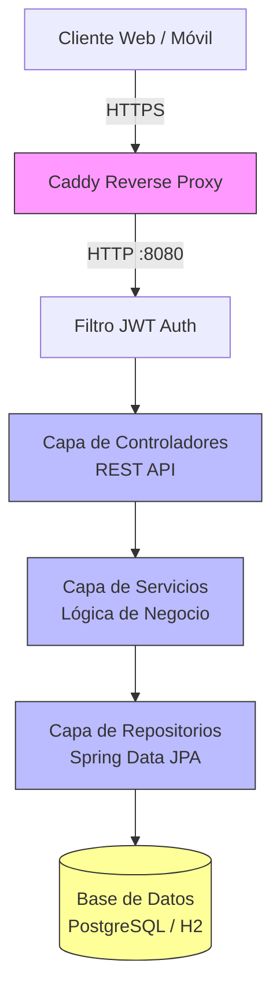

# 🌍 SafariTalk - Language Learning Platform Backend


¡Hola! Bienvenido al repositorio backend de **SafariTalk**, una plataforma integral de aprendizaje de idiomas que he diseñado para conectar a estudiantes con tutores en sesiones en tiempo real. 

> 💡 **Nota para el Reclutador:** Este repositorio contiene únicamente la API REST (Backend). Puedes explorar la interfaz de usuario de este proyecto en el **[Repositorio del Frontend (Angular 21) 🌐](https://github.com/albertwork15-art/safaritalk-frontend)**.

A través de este proyecto, he desarrollado una **API REST robusta y segura**. Me he enfocado en aplicar buenas prácticas de ingeniería de software para gestionar la autenticación de usuarios, la administración de perfiles, el control complejo de la disponibilidad de los tutores y la orquestación de la agenda de clases. Mi objetivo principal ha sido construir un sistema sólido, mantenible y altamente escalable.

---

## 🏗 Arquitectura del Sistema (N-Capas / MVC)

Para garantizar la mantenibilidad y un bajo acoplamiento del código, he estructurado el sistema utilizando una arquitectura de N-capas alineada con los principios de *Clean Architecture* e implementando el patrón Modelo-Vista-Controlador (MVC). 

En el siguiente diagrama comparto cómo he diseñado el flujo natural de los datos; desde las peticiones seguras administradas por Caddy hasta la persistencia final en mi base de datos:



---

## 🚀 Instrucciones de Ejecución

He configurado el proyecto para facilitar las pruebas, integraciones y revisiones técnicas. A continuación, presento los dos entornos que he aprovisionado para levantar la aplicación ágilmente:

### Opción A: Entorno de Desarrollo Local (H2 Database en memoria)
He implementado un perfil enfocado a `dev` para acelerar cualquier iteración en local sin la necesidad de levantar infraestructura externa.

1. **Clona el repositorio** e ingresa a la raíz del backend:
   ```bash
   cd lenguage-platform
   ```
2. **Levanta la API** utilizando el wrapper de Maven cargando el perfil de desarrollo para inyectar H2 en memoria automática:
   ```bash
   ./mvnw spring-boot:run -Dspring-boot.run.profiles=dev
   ```
3. El servicio estará activo bajo loggin detallado a la escucha en `http://localhost:8080`.

### Opción B: Entorno de Producción Aislado (PostgreSQL + Dockerizado)
Para demostrar el despliegue del ecosistema en su formato íntegro con proxy inverso y encriptado, he preparado un arnés de contenedores.

1. **Configura mi entorno**: Proporciona el archivo oculto `.env` (basado en el archivo base `.env.example`) y asigna allí mi `APP_SECURITY_JWT_SECRET`.
2. **Ejecuta la orquestación final**:
   ```bash
   cd lenguage-platform
   docker-compose up -d --build
   ```
3. Docker Compose instanciará al instante la base de datos PostgreSQL, compilará la API y levantará el proxy inverso que he configurado.

---

## 🔌 Estructura de Endpoints Principales

A continuación, detallo el núcleo y contrato de mis servicios REST elaborados. Apliqué estrategias consistentes de protección mediante esquemas de autorización **JWT (Bearer Token)** para salvaguardar toda entidad relacionada al usuario (eximiendo flujos netamente públicos, como lo es el ingreso e inscripción).

### 🔐 Autenticación y Cuentas de Identidad (`/api/auth` & `/api/users`)
| Método | Endpoint | Funcionalidad Específica | Nivel de Acceso |
|--------|----------|--------------------------|-----------------|
| `POST` | `/api/users/register` | Habilita el registro encriptado por BCrypt de Estudiantes o Tutores | Público |
| `POST` | `/api/auth/login` | Otorga Validación de credenciales para emisión cifrada del JWT temporal | Público |

### 🧑‍🏫 Exploración y Perfiles (`/api/student-profiles` & `/api/tutors`)
| Método | Endpoint | Funcionalidad Específica | Nivel de Acceso |
|--------|----------|--------------------------|-----------------|
| `GET`  | `/api/tutors` | Proyección dinámica de la plantilla de profesores disponibles | Público |
| `GET`  | `/api/student-profiles/{userId}` | Consumo exclusivo y blindado de datos personales formativos | Autenticado |
| `PUT`  | `/api/student-profiles/{userId}` | Control de subida del nivel y cambio referencial de métricas de usuario | Autenticado |

### 📅 Algoritismos de Disponibilidad y Sesiones (`/api/availability` & `/api/lessons`)
| Método | Endpoint | Funcionalidad Específica | Nivel de Acceso |
|--------|----------|--------------------------|-----------------|
| `POST` | `/api/availability` | Declaración de un slot temporal en blanco de la vitrina del tutor | Autenticado |
| `GET`  | `/api/availability/open-slots` | Verificación de superposiciones y lectura de bloques huecos | Autenticado |
| `POST` | `/api/lessons` | Orquesta de inserción y apartación estricta de cita | Autenticado |
| `GET`  | `/api/lessons/{id}` | Recupera la liga para acceder a la tutoría a salvo | Autenticado |

> **Acerca del Diseño General de mi API:** He establecido estándares transversales RESTful manejando meticulosamente cada código del estandard HTTP Status (200, 201, 401, 403, 404, 500), para que cualquier consumidor Front-end pueda iterar predeciblemente contra mi objeto estándar unificado de errores `ApiError`.
